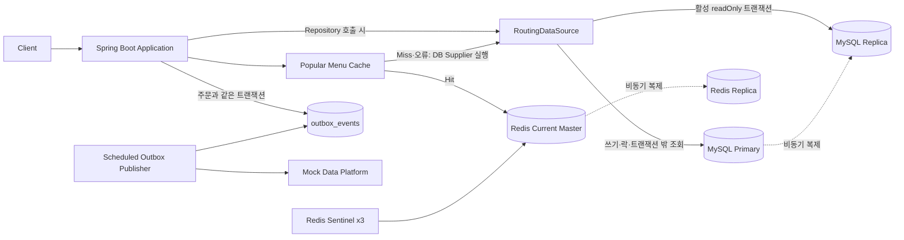

# Coffee Order System

> 다중 애플리케이션 인스턴스에서도 공유되는 MySQL 원본과 DB 락을 고려해 설계하고, 로컬 환경에서 포인트 정합성·조회 성능·장애 격리·후속 처리 신뢰성을 단계적으로 검증한 커피 주문 시스템

## 한눈에 보는 프로젝트 결과

| 영역 | 해결한 문제 | 선택한 방법 | 확인한 결과 |
|---|---|---|---|
| 필수 API | 메뉴·포인트·주문·인기 메뉴 기능 | Spring Boot·JPA·MySQL | 4개 API와 정상·실패·Rollback 테스트 |
| 주문 정합성 | 동일 사용자의 동시 주문에서 갱신 분실 | MySQL `PESSIMISTIC_WRITE` | 10개 동시 주문: 성공 3, 실패 7, 잔액 1,000P, 주문·USE 이력 각 3건 |
| 인기 메뉴 SQL | 최근 7일 TOP 3 집계 성능 | 실제 JPQL 기준 복합 인덱스 | 50만 건 격리 측정에서 중앙값 179.0ms → 66.0ms |
| Redis 캐시 | 반복 집계로 인한 DB 조회 부하 | MySQL 원본 + Redis Cache-Aside | Hit·Miss·TTL·직렬화 실패·Redis 장애 fallback 검증 |
| API 성능 | MySQL 직접 조회와 Cache Hit 차이 | K6 30 VU, 워밍업·본 측정 분리 | 평균 16.4% 감소, p95 18.4% 감소, RPS 19.6% 증가 |
| 후속 처리 | 메모리 기반 비동기 처리의 이벤트 유실 위험 | Transactional Outbox | 주문과 `PENDING` 이벤트 원자 저장, 상태 전이·재시도 검증 |
| MySQL 확장 | 읽기 부하 분리와 복제 지연 위험 | Primary·Replica + 트랜잭션 기반 라우팅 | readOnly 조회는 Replica, 쓰기·락은 Primary, stale read 재현 |
| Redis 가용성 | Master 장애와 Redis 전체 장애 | Master·Replica·Sentinel 3대 + DB fallback | 자동 승격·재연결, 전체 장애 중 인기 메뉴·주문·충전 기능 유지 확인 |
| 개발 프로세스 | AI 구현의 누락·과잉 자동화 위험 | Issue 계약·증거 추적·Human 승인 | 실제 누락을 발견하고 역할과 리뷰 Gate를 단계적으로 수정 |

> 성능 수치는 로컬 단일 장비의 제한된 Fixture 결과다. 운영 TPS나 SLA로 일반화하지 않는다.

## 1. 해결하려는 문제

과제의 필수 요구사항은 다음 네 가지다.

1. 커피 메뉴 목록 조회
2. 포인트 충전
3. 포인트 기반 주문·결제
4. 최근 7일 인기 메뉴 TOP 3 조회

단순 API 구현에 그치지 않고 다음 질문을 실제 코드와 테스트로 확인했다.

- 같은 사용자가 동시에 주문하면 포인트 잔액은 정확한가?
- 주문 실패 시 잔액·이력·주문·후속 이벤트가 함께 Rollback되는가?
- 인기 메뉴 조회 SQL에 어떤 인덱스가 실제 쿼리 구조와 맞는가?
- Redis가 장애여도 원본 조회와 주문 기능은 유지되는가?
- 외부 데이터 플랫폼 전송이 실패해도 주문 데이터는 보존되는가?
- Replica의 오래된 데이터를 정합성 판단에 사용하지 않도록 라우팅할 수 있는가?

## 2. 전체 아키텍처



### 책임 경계

- **MySQL Primary**: 주문, 포인트 잔액·이력, Outbox 이벤트의 정확한 원본
- **MySQL Replica**: 지연을 허용할 수 있는 읽기 전용 조회
- **Redis**: 인기 메뉴 조회 결과 캐시. 주문·랭킹의 원본이 아님
- **Sentinel**: Redis Master 감지, 장애 판단, Replica 승격과 현재 Master 정보 제공
- **Outbox Publisher**: DB에 남은 `PENDING` 이벤트를 외부 플랫폼으로 전송하고 상태를 갱신

자세한 설계는 [Software Architecture](docs/00_SOFTWARE_ARCHITECTURE.md)를 따른다.

## 3. 핵심 도메인·트랜잭션 흐름

### 주문·결제

```text
사용자 조회
→ ACTIVE 메뉴 조회
→ point_wallet 행 PESSIMISTIC_WRITE 잠금
→ 잔액 검증·차감
→ USE 이력 저장
→ COMPLETED 주문 저장
→ Outbox PENDING 이벤트 저장
→ Commit
```

위 변경은 하나의 트랜잭션에서 처리한다. 잔액 부족, 비활성 메뉴, Payload 직렬화 실패 등으로 트랜잭션이 실패하면 주문·포인트 사용 이력·Outbox 이벤트를 함께 남기지 않는다.

### 성공 주문만 저장하는 이유

`orders`는 실제 결제가 완료된 주문의 원본이다. 실패 요청까지 저장하면 인기 메뉴 집계와 주문 데이터의 의미가 복잡해진다. 따라서 포인트 부족·비활성 메뉴·사용자 없음 등의 요청은 `orders`에 저장하지 않는다.

### 시간 정책

- 애플리케이션 주문 시각 타입: UTC `Instant`
- JDBC·Hibernate 저장·조회 기준: UTC
- DB `ordered_at` 값: UTC 의미로 저장·해석
- 인기 메뉴 집계와 캐시 업무 날짜: `Asia/Seoul`
- 집계 범위: 오늘을 제외한 직전 7개 완료 일자, 시작 포함·종료 제외

이 정책으로 서버 기본 시간대와 무관하게 동일한 주문 시각과 KST 날짜 경계를 사용한다.

## 4. 주요 기술 선택과 대안

| 선택 | 이유 | 선택하지 않은 대안·한계 |
|---|---|---|
| DB 비관적 락 | 보호 대상이 MySQL `point_wallet.balance`이며 여러 App 인스턴스도 같은 Primary의 row lock을 공유하는 구조 | Redis 분산락은 원본 행 변경과 별도 실패 지점을 만들며 현재 문제에 과도함. 실제 다중 App 처리량은 미검증 |
| MySQL 집계 + Redis Cache-Aside | 정확성은 `orders`, 성능은 Redis로 책임 분리 | Redis ZSet은 DB·Redis 이중 쓰기, 기간 만료, 보정·재구축 책임이 추가됨 |
| 인덱스 `(menu_id, ordered_at, status)` | 실제 LEFT JOIN의 `menu_id` 경로와 covering 조건에 맞고 격리 측정 결과가 가장 낮음 | 상태 분포가 바뀌면 `(menu_id, status, ordered_at)`과 재측정 필요 |
| Transactional Outbox | 주문과 이벤트를 한 DB 트랜잭션으로 저장하고 Commit된 `PENDING` 이벤트를 Publisher가 다시 조회할 수 있게 함 | 외부 전송 성공 후 `SENT` 반영 전 장애 시 중복 가능. Exactly Once 미보장 |
| Spring RoutingDataSource | 트랜잭션의 readOnly 속성과 JPA 경로를 유지하며 읽기·쓰기를 분리 | ProxySQL·HAProxy·자동 DB Failover는 과제 범위를 넘으므로 제외 |
| Redis Sentinel | 단순 Master-Replica에 없는 자동 장애 판단·승격·Master 탐색 제공 | 무중단이나 데이터 무손실을 절대 보장하지 않음 |

## 5. 단계별 문제 해결과 검증

### v0 — 필수 API와 트랜잭션

| Method | Endpoint | 역할 |
|---|---|---|
| `GET` | `/api/menus` | ACTIVE 메뉴 목록 조회 |
| `POST` | `/api/users/{userId}/points/charge` | 포인트 충전과 `CHARGE` 이력 저장 |
| `POST` | `/api/orders` | 포인트 차감, `USE` 이력, 주문·Outbox 저장 |
| `GET` | `/api/menus/popular` | 최근 7일 인기 메뉴 TOP 3 조회 |

상세 요청·응답과 예외는 [API 명세](docs/03_API_SPEC.md)를 따른다.

### v1 — 동시 주문 문제 재현과 비관적 락

초기 조건은 잔액 10,000P, 메뉴 가격 3,000P, 동시 요청 10개다.

| 구분 | 락 미적용 | 비관적 락 적용 후 |
|---|---:|---:|
| 성공 요청 | 10 | 3 |
| 잔액 부족 실패 | 0 | 7 |
| 주문 | 10 | 3 |
| `USE` 이력 | 10 | 3 |
| 최종 잔액 | 7,000P 또는 4,000P | 1,000P |

락 미적용에서는 여러 요청이 같은 잔액을 읽고 덮어쓰면서 주문 수와 실제 차감액이 불일치했다. 적용 후에는 Primary의 사용자 지갑 행을 트랜잭션 종료까지 잠가 잔액 검증과 변경을 직렬화했다.

### v2 — 인기 메뉴 인덱스

실제 JPQL은 ACTIVE 메뉴에서 시작해 완료 주문을 LEFT JOIN한다. 주문이 0건인 ACTIVE 메뉴도 후보로 남기고, 주문 수 내림차순·동률 시 메뉴 ID 오름차순으로 정렬한다.

측정 조건: MySQL 8.4, 전용 스키마, 주문 500,000건, 메뉴 20개(15개 ACTIVE), 워밍업 3회 후 `EXPLAIN ANALYZE` 5회 중앙값.

| 인덱스 | 중앙값 | covering |
|---|---:|---|
| 기준 `(menu_id)` | 179.0ms | 아니오 |
| `(ordered_at, menu_id)` | 184.0ms | 아니오 |
| `(menu_id, status, ordered_at)` | 71.5ms | 예 |
| `(menu_id, ordered_at)` | 202.0ms | 아니오 |
| 최종 `(menu_id, ordered_at, status)` | 66.0ms | 예 |

최종 후보는 기준선보다 측정 중앙값이 약 63.1% 낮았지만, 쓰기 비용과 운영 데이터 분포는 측정하지 않았다. 상세 근거는 [인덱스 벤치마크](docs/benchmarks/issue-12-popular-menu-index.md)를 따른다.

### v2 — Redis Cache-Aside와 K6

- Key: `popular:menus:7days:{KST 업무 날짜}:v1`
- 기본 TTL: 86,400초
- Hit: Redis 결과 반환, MySQL 집계 생략
- Miss: readOnly DB 조회 후 Redis 저장
- Redis 읽기·쓰기·직렬화 오류: 경고 로그 후 DB 결과 반환
- 캐시 비활성화 설정: Redis를 호출하지 않는 MySQL 기준선 측정에 사용

K6 조건은 30 VU, 10초 워밍업, 30초 본 측정, 각 3회다.

| 시나리오 | 평균 응답시간 | 평균 p95 | 평균 RPS | 실패율 |
|---|---:|---:|---:|---:|
| MySQL 직접 조회 | 11.13ms | 14.48ms | 2,680.1 | 0% |
| Redis Cache Hit | 9.30ms | 11.81ms | 3,205.8 | 0% |

Cache Miss는 첫 요청 뒤 Hit로 바뀌므로 1 VU·1 iteration의 cold request 3개만 기록했고 p95·RPS 결론을 내리지 않았다. 상세 조건은 [K6 벤치마크](docs/benchmarks/issue-45-popular-menu-k6.md)를 따른다.

### v3 — 주문 후속 처리 진화

```text
동기 외부 호출
→ Spring Event
→ AFTER_COMMIT
→ @Async
→ Transactional Outbox
```

현재 production 경로는 Transactional Outbox다.

- 주문·포인트·`USE` 이력·Outbox `PENDING`을 원자적으로 Commit
- Publisher가 `PENDING`을 조회해 성공 시 `SENT` 처리
- 실패 시 `retryCount`와 `lastError` 기록
- 최대 재시도 도달 시 `FAILED`
- 같은 Outbox 이벤트의 재시도에는 같은 `eventId` 전달

남은 한계는 단일 Publisher 전제, Consumer 멱등 저장소 미구현, Exactly Once 미보장이다.

### v3 — MySQL Primary·Replica

- Primary: 쓰기 트랜잭션, 비관적 락, 트랜잭션 밖 조회
- Replica: 활성 `@Transactional(readOnly = true)` 조회
- `LazyConnectionDataSourceProxy`: 트랜잭션 속성이 결정된 뒤 실제 Connection 획득
- Replica SQL thread를 중지해 stale read를 재현하고 재개 후 복구 확인
- Replica 장애 시 자동 Primary fallback은 구현하지 않음

라우팅·DB 수준 복제와 장애 복구는 확인했지만, Replica 중지 중 메뉴 API의 실제 HTTP 오류 계약은 검증하지 않았다.

### v3 — Redis Sentinel과 DB fallback

구성은 Redis Master 1대, Replica 1대, Sentinel 3대, quorum 2다.

확인한 범위:

- 현재 Master 탐색과 Master→Replica 복제
- Master 장애 감지와 Replica 승격
- 애플리케이션의 새 Master 재연결
- 연속 두 번의 Failover 스크립트 성공
- Redis·Sentinel 전체 중지 중 인기 메뉴 HTTP 200과 DB fallback
- 같은 장애 중 포인트 충전·주문 HTTP 200 및 MySQL 상태 확인
- Redis 복구 후 애플리케이션 재시작 없이 캐시 재생성
- 공유 연결 검증 적용 전 약 43초였던 로컬 복구 지연이 적용 후 첫 요청 0초로 확인

이는 로컬 Docker 장애 주입 결과이며 운영 무중단·데이터 무손실·SLA를 의미하지 않는다.

## 6. 테스트와 증거의 범위

| 검증 | 보장하는 범위 | 보장하지 않는 범위 |
|---|---|---|
| 단위·통합 테스트 | API 규칙, Rollback, 캐시 Hit/Miss·TTL, Outbox 상태 전이 | 운영 트래픽과 장기 장애 |
| 실제 MySQL 동시성 테스트 | 동일 사용자 10개 요청의 잔액·주문·이력 정합성 | 락 타임아웃·데드락 재시도·처리량 |
| 인덱스 벤치마크 | 격리 Fixture에서 후보별 실행계획과 중앙값 | HTTP 비용·혼합 쓰기·운영 분포 |
| K6 | 해당 로컬 조건의 MySQL/Cache Hit 비교 | 운영 TPS·캐시 Stampede |
| Replication 검증 | 실제 복제, 라우팅, stale read·DB 복구 | 자동 DB Failover·Replica 장애 HTTP 계약 |
| Sentinel 장애 주입 | 승격·재연결·전체 장애 fallback·복구 | 절대적 무중단과 캐시 무손실 |

## 7. AI-assisted 개발과 Human 검증

AI 사용량이 아니라 **AI가 만든 결과를 사람이 어떻게 검증하고 수정했는지**를 기록했다.

대표 사례:

1. 문제 재현 없이 Event·AFTER_COMMIT을 완료 조건으로 넣은 설계를 Human이 지적해 동기 기준선부터 단계적으로 검증했다.
2. 주문 저장 시각과 인기 메뉴 업무 날짜가 달랐던 문제를 발견해 UTC `Instant` 저장과 KST 계산으로 통일했다.
3. 예상 인덱스를 바로 적용하지 않고 실제 JPQL·데이터 분포·`EXPLAIN ANALYZE`로 후보를 다시 결정했다.
4. Redis ZSet 원본화를 배제하고 MySQL 원본 + Cache-Aside로 범위를 축소했다.
5. Outbox `eventId`가 Entity에만 존재하고 외부 Client까지 전달되지 않던 누락을 Human이 발견해 end-to-end 전달을 검증했다.
6. Codex가 Human 답변을 평가·보완하던 역할 충돌을 제거하고 ChatGPT PR 전체 검증과 Human 반영 결정을 분리했다.
7. 상시 멀티에이전트·과도한 Hook보다 하나의 READY Issue를 끝까지 처리하는 최소 하네스로 축소했다.

최종 PR 흐름:

```text
Codex 구현·검증·Draft PR
→ Human 이해도 작성
→ ChatGPT PR 전체 검증 및 리뷰 댓글
→ Human 반영 범위 결정
→ Codex 승인된 리뷰 수정
→ ChatGPT 최신 Head 재검토
→ Human 최종 Merge
```

자세한 기록은 [AI Workflow](docs/05_AI_WORKFLOW.md), [Review Log](docs/10_AI_REVIEW_LOG.md), [Workflow Evolution](docs/13_AI_WORKFLOW_EVOLUTION.md)을 따른다.

## 8. 실행·재현

### 기본 실행

```bash
# 환경변수 예시 복사 후 값 확인
cp .env.example .env

# 기본 MySQL Primary·Replica와 Redis Master 실행
docker compose up -d mysql-primary mysql-replica redis-master

./gradlew bootRun
```

```bash
./gradlew test
./gradlew build
```

실제 MySQL 동시성 테스트는 기본 테스트와 분리했다.

```bash
DB_USERNAME="$MYSQL_USER" DB_PASSWORD="$MYSQL_PASSWORD" ./gradlew --no-daemon concurrencyTest
```

### MySQL 복제 확인

```bash
docker compose exec mysql-replica sh -c \
  'mysql -uroot -p"$MYSQL_ROOT_PASSWORD" -e "SHOW REPLICA STATUS\\G"'
```

- Primary: `localhost:3307`
- Replica: `localhost:3308`
- Replica Docker volume 초기화는 기존 데이터를 삭제할 수 있으므로 `docker compose down -v`를 무조건 실행하지 않는다.

### Redis Sentinel HA 검증

```bash
docker compose --profile redis-ha up -d --build app-ha
curl http://localhost:18080/api/menus/popular

docker compose exec redis-sentinel-1 \
  redis-cli -p 26379 SENTINEL CKQUORUM coffee-order-redis

docker compose exec redis-sentinel-1 \
  redis-cli -p 26379 SENTINEL GET-MASTER-ADDR-BY-NAME coffee-order-redis

scripts/redis/verify-sentinel-failover.sh
```

Sentinel 전용 통합 테스트:

```bash
docker compose --profile redis-ha-test run --rm redis-ha-integration-test
```

장애 스크립트는 Redis Master를 중지·복구하므로 로컬 개발 환경에서만 실행한다.

## 9. 문서

- [Software Architecture](docs/00_SOFTWARE_ARCHITECTURE.md)
- [Project Context](docs/01_PROJECT_CONTEXT.md)
- [Requirements](docs/02_REQUIREMENTS.md)
- [API Spec](docs/03_API_SPEC.md)
- [ERD](docs/04_ERD.md)
- [AI Workflow](docs/05_AI_WORKFLOW.md)
- [Troubleshooting](docs/09_TROUBLESHOOTING.md)
- [AI Review Log](docs/10_AI_REVIEW_LOG.md)
- [Evidence Guide](docs/12_EVIDENCE_GUIDE.md)
- [AI Workflow Evolution](docs/13_AI_WORKFLOW_EVOLUTION.md)
- [ADR-001 인기 메뉴 캐시 전략](docs/adr/ADR-001-popular-menu-cache-strategy.md)
- [인기 메뉴 인덱스 벤치마크](docs/benchmarks/issue-12-popular-menu-index.md)
- [인기 메뉴 Redis 캐시 검증](docs/benchmarks/issue-13-popular-menu-redis-cache.md)
- [인기 메뉴 K6 비교](docs/benchmarks/issue-45-popular-menu-k6.md)

## 10. 알려진 한계와 후속 개선

- Outbox Publisher는 단일 애플리케이션 인스턴스를 전제로 하며 멀티 인스턴스 선점 경쟁을 처리하지 않는다.
- 실제 애플리케이션 프로세스 강제 종료·재시작 후 Outbox 전송 재개 E2E는 검증하지 않았다.
- 외부 Consumer의 `eventId` 멱등 저장소가 없어 Exactly Once를 보장하지 않는다.
- Replica 장애 시 읽기 요청의 자동 Primary fallback과 HTTP 오류 규격은 구현하지 않았다.
- MySQL Primary 자동 Failover, ProxySQL·HAProxy·Orchestrator는 제외했다.
- Redis Failover 직전 비동기 복제가 끝나지 않은 캐시는 유실될 수 있으며 다음 Miss에서 DB 조회로 재구축한다.
- Cache Stampede, 과거 주문 수정에 대한 즉시 캐시 무효화, 운영 규모 성능은 미검증이다.
- 인증·인가, 실제 PG, RabbitMQ·Kafka, MSA·Kubernetes는 과제 핵심 문제와 시간 대비 효율을 고려해 제외했다.
