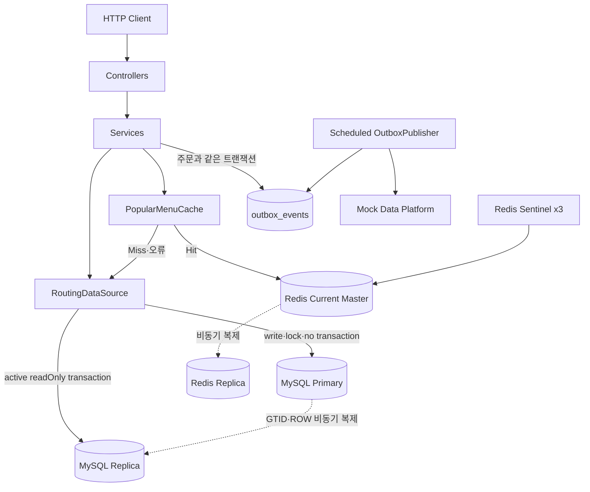
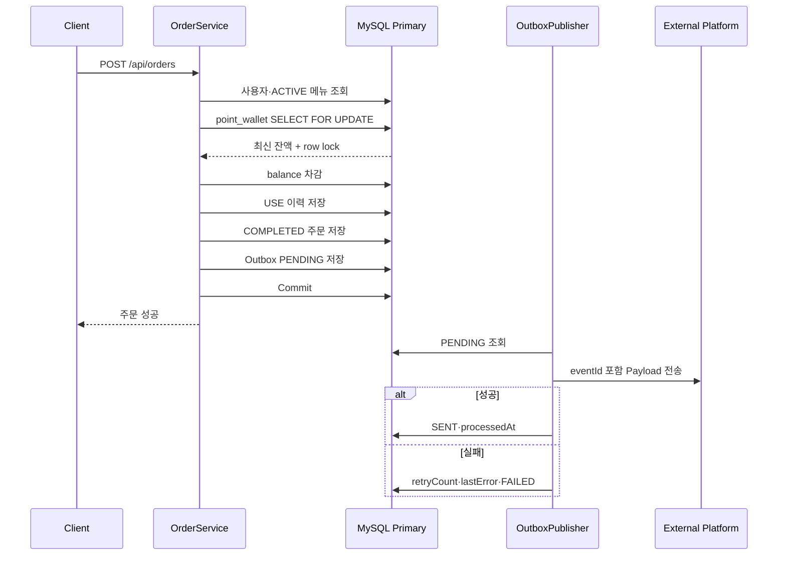
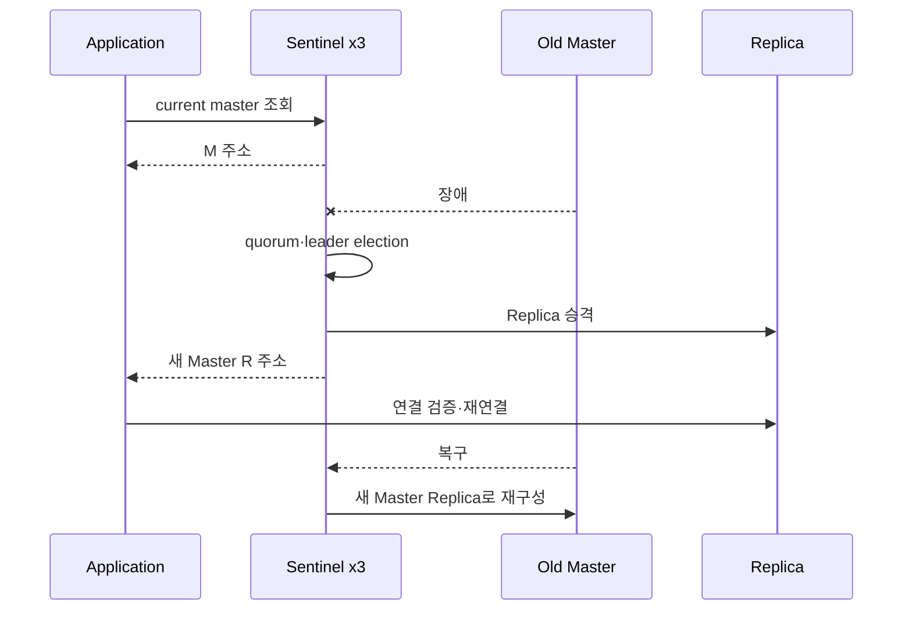

# Software Architecture

## 1. 문서 목적

이 문서는 포인트 기반 커피 주문 시스템의 기능 요구사항, 설계 의도, 문제 해결 전략, 기술 선택과 검증 결과를 연결하는 최상위 설계 문서다.

- `README.md`: 3~5분 프로젝트 요약
- 이 문서: 아키텍처, 트랜잭션, 데이터 원본, 성능·장애 설계 상세
- 전문 문서: API, ERD, ADR, benchmark, troubleshooting의 원본 증거

최신 코드·병합 PR·테스트·직접 검증에서 확인된 범위만 기록한다. 운영 환경 성능·무중단·Exactly Once를 추정해 성공으로 표시하지 않는다.

## 2. 한눈에 보는 결과

| 관심사 | 문제 | 선택 | 확인된 결과 | 남은 한계 |
|---|---|---|---|---|
| 필수 기능 | 메뉴·포인트·주문·인기 메뉴 | Spring Boot·JPA·MySQL | 4개 API, 정상·실패·Rollback | 인증·실제 PG 제외 |
| 주문 원자성 | 일부 데이터만 반영될 위험 | 단일 DB 트랜잭션 | 지갑·이력·주문·Outbox 함께 Commit/Rollback | 외부 시스템까지 단일 트랜잭션 아님 |
| 동시성 | 동일 잔액의 Lost Update | Primary 지갑 행 `PESSIMISTIC_WRITE` | 성공 3, 실패 7, 잔액 1,000P | timeout·deadlock 재시도 없음 |
| 인기 메뉴 | 기간·정렬·0건 메뉴와 조회 비용 | MySQL 원본 + covering index | 50만 건 중앙값 179.0ms → 66.0ms | 혼합 쓰기 비용 미측정 |
| 캐시 | 반복 집계 DB 부하 | Redis Cache-Aside | Hit·Miss·TTL·오류 fallback | Stampede·즉시 무효화 없음 |
| API 성능 | DB 직접 조회와 Hit 차이 | K6 상태 분리 | 평균 -16.4%, p95 -18.4%, RPS +19.6% | 로컬 결과, 운영 일반화 금지 |
| 후속 처리 | 외부 실패·서버 종료 시 유실 | Transactional Outbox | PENDING/SENT/FAILED·재시도 | Exactly Once 미보장 |
| MySQL 확장 | 읽기 부하와 stale read | Primary·Replica 라우팅 | 실제 JPA 라우팅·복제 지연 재현 | 자동 DB Failover 없음 |
| Redis 가용성 | Master 단일 장애점 | Replica·Sentinel 3대·DB fallback | 승격·재연결·전체 장애 복구 | 무중단·무손실 보장 아님 |
| AI 협업 | AI 누락·과잉 자동화 | 계약·증거·Human 결정 | 실제 오류를 찾아 Workflow 수정 | Human 최종 책임 유지 |

## 3. 요구사항

### 3.1 필수 API

| 기능 | Method | Endpoint | 핵심 데이터 변경 |
|---|---|---|---|
| 메뉴 조회 | `GET` | `/api/menus` | 없음 |
| 포인트 충전 | `POST` | `/api/users/{userId}/points/charge` | 지갑 증가, `CHARGE` 이력 |
| 주문·결제 | `POST` | `/api/orders` | 지갑 차감, `USE`, 주문, Outbox |
| 인기 메뉴 | `GET` | `/api/menus/popular` | Cache Miss 시 Redis 저장 |

상세 HTTP 계약은 [API 명세](03_API_SPEC.md)를 따른다.

### 3.2 핵심 도메인 규칙

- 수량은 1개, 주문당 메뉴는 1개다.
- ACTIVE 메뉴만 주문할 수 있다.
- 포인트 잔액은 음수가 될 수 없다.
- 성공한 주문만 `orders`에 `COMPLETED`로 저장한다.
- 충전은 `CHARGE`, 주문 사용은 `USE` 이력을 남긴다.
- 인기 메뉴 정확성 원본은 MySQL `orders`다.
- 주문 후속 이벤트는 주문과 원자적으로 DB에 저장하고 외부 전송은 분리한다.

### 3.3 과제 필수 문서 추적

| 발제 요구 | 반영 위치 |
|---|---|
| ERD·API 명세 | 이 문서, [ERD](04_ERD.md), [API](03_API_SPEC.md) |
| 설계 의도 | 트랜잭션, 동시성, 데이터 원본, 시간대, 장애 격리 |
| 문제 해결 전략 | 문제 재현 → 최소 기술 선택 → 테스트·측정·장애 주입 |
| 기술 선택 이유 | 대안·트레이드오프와 검증 제한 |
| 다중 서버·동시성·일관성 | DB row lock, Primary·Replica, Sentinel·fallback |

## 4. 비기능 요구사항

### 데이터 일관성

- 잔액, `USE` 이력, 주문, Outbox는 한 트랜잭션에서 변경한다.
- 최신 정합성 판단과 비관적 락은 Primary에서 수행한다.
- Redis와 Replica의 오래된 값은 주문 가능 여부 판단에 사용하지 않는다.

### 동시성

- 같은 사용자의 지갑 행 변경만 직렬화한다.
- 서로 다른 사용자 지갑은 서로 다른 행을 잠가 전역 직렬화를 피한다.
- 성공 수, 실패 수, 최종 잔액, 주문·이력 수를 함께 검증한다.

### 성능

- 실제 JPQL·실행계획·데이터 분포를 기준으로 인덱스를 결정한다.
- 반복 인기 메뉴 조회는 Redis Hit로 DB 집계를 생략한다.
- 측정 환경, 반복 수, 지표와 일반화 제한을 함께 기록한다.

### 가용성과 장애 격리

- Redis 장애는 캐시 실패로 제한하고 DB 조회 결과를 반환한다.
- 주문·포인트 Service는 Redis를 사용하지 않는다.
- Replica 장애가 Primary 쓰기 연결을 중단하지 않게 분리한다.
- 외부 플랫폼 장애는 완료 주문을 Rollback하지 않고 Outbox 재시도로 남긴다.

## 5. 전체 구성도



### 책임 경계

- **Controller**: HTTP 입력 검증과 DTO 응답
- **Service**: 도메인 흐름과 트랜잭션
- **Repository**: JPA 저장·조회, 락, 집계 Projection
- **MySQL Primary**: 포인트·주문·Outbox의 정확한 원본
- **MySQL Replica**: 지연을 허용할 수 있는 readOnly 조회
- **Redis**: 인기 메뉴 결과 캐시
- **Sentinel**: Redis Master 감지·승격·주소 제공
- **OutboxPublisher**: Commit된 이벤트 외부 전송과 상태 갱신

## 6. ERD

```mermaid
erDiagram
    USERS ||--|| POINT_WALLET : owns
    USERS ||--o{ POINT_HISTORY : has
    USERS ||--o{ ORDERS : places
    MENU ||--o{ ORDERS : ordered_as
    ORDERS ||--o{ OUTBOX_EVENTS : emits_logically

    USERS {
        bigint id PK
        varchar name
    }
    POINT_WALLET {
        bigint id PK
        bigint user_id FK UK
        bigint balance
    }
    POINT_HISTORY {
        bigint id PK
        bigint user_id FK
        bigint amount
        varchar type
        bigint balance_after
    }
    MENU {
        bigint id PK
        varchar name
        bigint price
        varchar status
    }
    ORDERS {
        bigint id PK
        bigint user_id FK
        bigint menu_id FK
        bigint order_price
        varchar status
        datetime ordered_at
    }
    OUTBOX_EVENTS {
        bigint id PK
        varchar event_id UK
        varchar event_type
        bigint aggregate_id
        text payload
        varchar status
        int retry_count
        varchar last_error
        datetime created_at
        datetime processed_at
    }
```

`outbox_events.aggregate_id`에는 주문 ID가 저장되지만 JPA FK 연관관계와 주문당 개수 UNIQUE 제약은 없다. 현재 Service는 주문 성공 시 `ORDER_COMPLETED` 이벤트 1개를 저장하지만 DB는 향후 주문당 여러 이벤트를 허용한다. 전체 컬럼과 인덱스는 [ERD 문서](04_ERD.md)를 따른다.

## 7. 주문·결제 트랜잭션



### 정상 흐름

```text
사용자 조회
→ ACTIVE 메뉴 검증
→ Primary 지갑 PESSIMISTIC_WRITE
→ 잔액 검증·차감
→ USE 이력
→ COMPLETED 주문
→ Outbox PENDING
→ Commit
```

### Rollback

다음 중 하나라도 주문 트랜잭션 안에서 실패하면 지갑 차감, `USE`, 주문, Outbox를 함께 Rollback한다.

- 사용자·메뉴·지갑 없음
- 메뉴 비활성
- 포인트 부족
- 주문 저장 실패
- Outbox Payload 생성·저장 실패

외부 전송은 Commit된 Outbox를 별도 처리하므로 플랫폼 장애가 주문을 되돌리지 않는다.

### 성공 주문만 저장

`orders`의 의미를 결제 완료 주문으로 고정해 주문 내역과 인기 메뉴 집계를 단순하게 유지한다. 취소·환불·결제 대기 상태를 도입하면 상태 모델, 집계 조건과 인덱스를 다시 설계해야 한다.

## 8. 동시성 제어

### 적용 전 문제

10,000P 사용자가 3,000P 메뉴를 동시에 10번 주문했을 때 락이 없으면 여러 트랜잭션이 같은 잔액을 읽는다. 테스트에서 주문·USE 이력은 10건인데 최종 잔액은 7,000P 또는 4,000P로 남아 실제 차감 횟수와 불일치했다.

### 선택

```text
PointWalletRepository.findByUserForUpdate
→ PESSIMISTIC_WRITE
→ 최신 잔액 검증·변경
→ Commit/Rollback 시 lock 해제
```

보호 대상은 Redis Key가 아니라 Primary MySQL의 `point_wallet.balance`다. 같은 Primary를 보는 여러 App 인스턴스에는 DB row lock이 공통으로 작동한다.

### 적용 후

| 항목 | 결과 |
|---|---:|
| 초기 잔액 | 10,000P |
| 메뉴 가격 | 3,000P |
| 동시 요청 | 10 |
| 성공 | 3 |
| 잔액 부족 | 7 |
| 주문·USE 이력 | 각 3 |
| 최종 잔액 | 1,000P |

### 대안

Redis 분산락은 락 TTL·소유권·해제 실패와 DB 트랜잭션의 이중 실패 경계를 만든다. 현재 문제에는 원본 행을 직접 잠그는 DB 비관적 락이 더 단순하고 검증 가능하다.

남은 범위는 lock timeout, deadlock 재시도, 주문·충전 혼합 경합과 처리량이다.

## 9. 인기 메뉴 집계

### 정확성 정책

- `Asia/Seoul` 기준 오늘 제외 직전 7개 완료 일자
- 시작 포함, 종료 제외
- ACTIVE 메뉴와 COMPLETED 주문
- 주문 0건 ACTIVE 메뉴도 후보
- 주문 수 내림차순, 동률 시 메뉴 ID 오름차순
- 최대 3개, 없으면 빈 배열

### 실제 쿼리 구조

```sql
SELECT m.id, m.name, COUNT(o.id)
FROM menu m
LEFT JOIN orders o
  ON o.menu_id = m.id
 AND o.status = :completed
 AND o.ordered_at >= :fromInclusive
 AND o.ordered_at < :toExclusive
WHERE m.status = :active
GROUP BY m.id, m.name
ORDER BY COUNT(o.id) DESC, m.id ASC
LIMIT 3;
```

기간·주문 상태를 LEFT JOIN `ON` 절에 둬 주문이 없는 ACTIVE 메뉴를 제거하지 않는다.

## 10. 인덱스 전략

단순 SQL 예시의 `ordered_at` 선두 인덱스를 정답으로 가정하지 않고 실제 ACTIVE 메뉴 시작 LEFT JOIN과 Projection을 기준으로 후보를 비교했다.

### 측정 조건

- MySQL 8.4
- 격리 benchmark 스키마
- 주문 500,000건
- 메뉴 20개, ACTIVE 15개
- 최근 7일 약 10%
- 워밍업 3회, `EXPLAIN ANALYZE` 5회 중앙값

| 후보 | 중앙값 | covering |
|---|---:|---|
| `(menu_id)` | 179.0ms | 아니오 |
| `(ordered_at, menu_id)` | 184.0ms | 아니오 |
| `(menu_id, status, ordered_at)` | 71.5ms | 예 |
| `(menu_id, ordered_at)` | 202.0ms | 아니오 |
| 최종 `(menu_id, ordered_at, status)` | 66.0ms | 예 |

현재 모든 주문이 `COMPLETED`라 `status` 선택도는 없다. 이번 표본에서 최종 D가 가장 낮았지만 B보다 구조적으로 항상 빠르다고 단정하지 않는다. 상태 분포가 바뀌면 재측정한다.

최종 인덱스 공간은 기준선 대비 약 21.7% 증가했다. 혼합 쓰기 비용은 미측정이다. 원본은 [Issue #12 benchmark](benchmarks/issue-12-popular-menu-index.md)를 따른다.

## 11. Redis Cache-Aside

### 데이터 원본

```text
정확한 원본: MySQL orders
성능용 복사본: Redis 조회 결과
```

Redis ZSet 직접 누적은 DB Commit·Redis 증가 불일치, 7일 윈도우 만료, 장애 복구·보정 책임을 추가하므로 선택하지 않았다.

### 정책

```text
Key: popular:menus:7days:{KST businessDate}:v1
기본 TTL: 86,400초
```

```text
Hit → Redis 결과 반환, DB 생략
Miss → readOnly DB 조회, Redis 저장, 결과 반환
Redis read/write/deserialize 실패 → warn, DB 결과 반환
```

Cache Miss의 DB 조회는 `MenuService`의 활성 readOnly 트랜잭션 안에서 실행되므로 현재 라우팅 정책상 Replica 대상이다. Replica 장애 자동 Primary fallback은 없다.

TTL은 날짜 전환을 만드는 수단이 아니라 이전 Key 정리 정책이다. 같은 업무 날짜에 과거 주문·메뉴 상태가 수정되면 TTL 동안 stale할 수 있다.

### K6 결과

조건: 30 VU, 10초 워밍업, 30초 측정, 각 3회.

| 시나리오 | 평균 | p95 | RPS | 실패율 |
|---|---:|---:|---:|---:|
| MySQL 직접 조회 | 11.13ms | 14.48ms | 2,680.1 | 0% |
| Cache Hit | 9.30ms | 11.81ms | 3,205.8 | 0% |

- 평균 약 16.4% 감소
- p95 약 18.4% 감소
- RPS 약 19.6% 증가

Cache Miss는 첫 요청 이후 Hit가 되므로 1 VU·1 iteration cold request만 기록했고 p95·처리량 결론을 내리지 않았다. 로컬 단일 장비 결과이며 [Issue #45 문서](benchmarks/issue-45-popular-menu-k6.md)를 따른다.

## 12. 주문 후속 처리

### 단계별 진화

| 단계 | 확인한 문제 | 개선 |
|---|---|---|
| 동기 외부 호출 | 외부 지연·실패가 응답·Rollback에 영향 | 책임 분리 필요 확인 |
| Spring Event | 코드 결합 감소 | 같은 호출 스택·트랜잭션 영향 남음 |
| AFTER_COMMIT | Rollback 주문 전송 방지 | Commit 후 프로세스 장애 시 유실 |
| `@Async` | 응답 지연 분리 | Executor 포화·서버 종료 시 메모리 이벤트 유실 |
| Transactional Outbox | DB에 재시도 이벤트 원자 저장 | 중복·멀티 Publisher 경쟁 남음 |

현재 production 경로는 Transactional Outbox다.

### 상태와 재시도

- `PENDING`: 전송 대상
- `SENT`: 성공과 `processedAt`
- `FAILED`: 최대 재시도 도달
- `retryCount`, `lastError`: 실패 기록
- `eventId`: 같은 Outbox 재시도의 동일성 키

### 전달 보장 한계

```text
외부 전송 성공
→ SENT 반영 전 장애
→ PENDING 재조회
→ 같은 eventId 중복 전송 가능
```

Consumer 멱등 저장소가 없어 Exactly Once를 보장하지 않는다. 후속 개선은 Consumer `eventId` UNIQUE 처리, 멀티 Publisher `SKIP LOCKED`, backoff·DLQ다.

## 13. MySQL Primary·Replica

### 라우팅

| 문맥 | 대상 | 이유 |
|---|---|---|
| 활성 readOnly 트랜잭션 | Replica | 지연 허용 조회 부하 분리 |
| 쓰기 트랜잭션 | Primary | 원본 변경·최신 값 |
| 트랜잭션 밖 조회 | Primary | 보수적 기본값 |
| 비관적 락 | Primary | 원본 행과 같은 lock |

`AbstractRoutingDataSource`가 트랜잭션 상태를 읽고, `LazyConnectionDataSourceProxy`가 속성 결정 뒤 실제 Connection을 획득한다.

지갑을 Replica에서 읽으면 복제 지연 잔액일 수 있고 Replica lock은 Primary 행을 보호하지 못하므로 주문·충전 정합성 경로에는 사용하지 않는다.

### 검증

- Primary 쓰기→Replica 복제
- 실제 JPA 메뉴 조회→Replica
- 주문·충전·비관적 락→Primary
- Replica SQL thread 중지→stale read→재개 후 복구
- Replica 중지 중 Primary 쓰기 probe 지속

Replica 장애 시 자동 Primary fallback은 구현하지 않았다. 장애 순간 읽기 부하가 Primary로 몰려 주문 원본 경로를 위협할 수 있기 때문이다. DB 수준 검증은 했지만 Replica 장애 중 메뉴 API의 실제 HTTP 오류 계약은 미검증이다.

## 14. Redis Sentinel

### 구성

- Master 1
- Replica 1
- Sentinel 3
- quorum 2
- Spring Data Redis Sentinel 연결
- `redis-ha` profile의 Lettuce 연결 유효성 검증

### Failover



### 직접 확인

- `SENTINEL CKQUORUM` 성공
- Master 주소·역할 전환
- 연속 두 번 Failover 스크립트 exit 0
- `+promoted-slave`, `+switch-master` 로그
- Redis·Sentinel 전체 장애 중 인기 메뉴 HTTP 200·DB fallback
- 같은 장애 중 충전·주문 HTTP 200과 MySQL 상태
- 복구 후 App 재시작 없이 캐시 재생성·다음 Hit
- 연결 검증 전 약 43초 로컬 지연, 적용 후 첫 요청 0초

이는 로컬 Docker 장애 주입 결과다. Failover 중 지연·일부 실패와 비동기 복제 미완료 캐시 유실 가능성이 있으며 운영 SLA·무중단·무손실을 의미하지 않는다.

## 15. 시간대 정책

| 대상 | 정책 |
|---|---|
| 주문·Outbox DB 시각 | UTC `Instant` |
| JDBC·Hibernate | UTC |
| 주문 API 표현 | KST 변환 |
| 인기 메뉴 기간 | KST 자정 |
| Redis Key 날짜 | KST 업무 날짜 |

DB에는 서버 위치와 무관한 절대 시각을 저장하고 “오늘”은 서비스 업무 시간대인 KST로 계산한다. 고정 `Clock` 테스트로 UTC·KST 날짜가 다른 경계를 검증하며 시스템 기본 Zone에 의존하지 않는다.

## 16. 테스트·검증 전략

| 계층 | 목적 | 비보장 범위 |
|---|---|---|
| 단위·H2 통합 | 규칙·예외·Rollback | 실제 DB lock·운영 설정 |
| MySQL `concurrencyTest` | 실제 row lock과 동시 정합성 | timeout·처리량 |
| Redis 통합 | Key·TTL·Hit·만료·fallback | Sentinel 운영 장애 |
| Replication 통합 | 실제 Service·Repository 라우팅 | 자동 Failover |
| Docker 장애 주입 | stale read·Sentinel·전체 장애 | 운영 SLA |
| K6 | 동일 로컬 조건 비교 | 운영 TPS |

`./gradlew test`는 환경 의존 동시성 테스트를 제외하고, 실제 MySQL 테스트는 별도 `concurrencyTest`로 실행한다. Sentinel 통합 테스트도 Docker network profile로 분리한다.

### 증거 원칙

- 실행한 명령·환경·원본 결과 기록
- 보장·비보장 범위 분리
- 무효 K6 실행 제외
- benchmark 수치와 README·PR 요약 대조
- Issue 체크박스보다 merged Diff·실제 코드 우선

## 17. 주요 대안과 트레이드오프

| 문제 | 선택 | 대안 | 판단 |
|---|---|---|---|
| 포인트 동시성 | DB 비관적 락 | 낙관락·조건부 UPDATE·Redis 락 | 원본 행을 직접 보호 |
| 인기 메뉴 | MySQL 집계 + 결과 캐시 | Redis ZSet | 정합성·복구 단순성 우선 |
| 읽기 분리 | RoutingDataSource | Repository 이중화·ProxySQL | 현재 JPA 구조와 학습 범위 유지 |
| Replica 장애 | 명시적 읽기 실패 | 자동 Primary fallback | Primary 연쇄 과부하를 숨기지 않음 |
| Redis HA | Sentinel | 단순 복제·Cluster | 자동 승격 필요, 샤딩 불필요 |
| 외부 이벤트 | Outbox | AFTER_COMMIT·Async·브로커 직행 | 주문 Commit과 이벤트 존재 원자성 |
| 전송 | Scheduled Publisher | RabbitMQ·Kafka | 현재 규모에서 운영비보다 검증 우선 |

## 18. AI-assisted 개발에서 발견한 문제

### 후속 처리 빌드업 누락

처음부터 Event·AFTER_COMMIT을 완료 조건으로 넣어 동기 외부 호출의 지연·실패 기준선을 건너뛰었다. Human 지적으로 동기 → Event → AFTER_COMMIT → Async → Outbox를 단계적으로 검증했다.

### 시간대 불일치

주문 시각과 인기 메뉴 업무 날짜가 다른 기준을 사용했다. UTC `Instant` 저장, KST 업무 날짜, 고정 Clock 경계 테스트로 통일했다.

### 인덱스 전제 오류

예상 SQL의 컬럼 순서를 적용하지 않고 실제 JPQL·50만 건 실행계획으로 후보를 다시 결정했다.

### K6 무효 결과 제외

최초 Docker K6는 Spring Boot 세션이 유지되지 않아 유효 요청이 없었다. 해당 결과를 제외하고 Human 로컬의 상태 통제·반복 측정만 사용했다.

### Outbox `eventId` 전달 누락

Entity와 Payload에 필드가 있어도 Client까지 전달되지 않으면 멱등성 계약이 아니다. Human이 누락을 발견해 DB→Payload→역직렬화→Client→재시도 동일성을 검증했다.

### AI 역할 충돌과 자동화 축소

Codex가 구현과 Human 답변 평가를 동시에 맡던 역할을 제거했다. 상시 멀티에이전트·과도한 Hook도 실제 백엔드 작업 시간을 침범해 최소 하네스로 축소했다.

```text
Codex 구현·검증·Draft PR
→ Human 이해도 작성
→ ChatGPT PR 전체 검증·리뷰
→ Human 반영 범위 결정
→ Codex 승인된 수정
→ ChatGPT 최신 Head 재검토
→ Human Merge
```

## 19. 실행·재현

### 기본

```bash
cp .env.example .env
docker compose up -d mysql-primary mysql-replica redis-master
./gradlew bootRun
```

### 일반 검증

```bash
./gradlew test
./gradlew build
git diff --check
git status
git diff --stat
git diff
```

### 실제 MySQL 동시성

```bash
set -a; source .env; set +a
DB_USERNAME="$MYSQL_USER" DB_PASSWORD="$MYSQL_PASSWORD" \
  ./gradlew --no-daemon concurrencyTest
```

### MySQL 복제

```bash
docker compose up -d mysql-primary mysql-replica
docker compose exec mysql-replica sh -c \
  'mysql -uroot -p"$MYSQL_ROOT_PASSWORD" -e "SHOW REPLICA STATUS\\G"'
```

초기화 스크립트는 빈 volume에서만 실행된다. `docker compose down -v`는 데이터를 삭제하므로 무조건 실행하지 않는다.

### Redis Sentinel

```bash
docker compose --profile redis-ha up -d --build app-ha
scripts/redis/verify-sentinel-failover.sh
docker compose --profile redis-ha-test run --rm redis-ha-integration-test
```

장애 스크립트는 로컬 개발 환경에서만 실행한다.

### K6

```bash
scripts/k6/run-popular-menu-benchmark.sh mysql
scripts/k6/run-popular-menu-benchmark.sh hit
scripts/k6/run-popular-menu-benchmark.sh miss
```

캐시 설정, App 프로세스 유지, Key 상태를 확인하고 실행한다.

## 20. 알려진 한계와 확장 순서

### 현재 한계

- 인증·인가, 실제 PG 없음
- 주문 수량·취소·환불 상태 없음
- Outbox 다중 Publisher 선점 없음
- Consumer 멱등 저장소·Exactly Once 없음
- MySQL Primary 자동 Failover 없음
- Replica 장애 HTTP 오류 계약 미검증
- Redis Failover 중 지연·일부 실패·캐시 유실 가능
- Cache Stampede·즉시 무효화 없음
- 운영 규모 부하·장기 관측·Migration 도구 없음

### 후속 우선순위

1. Consumer 멱등성과 멀티 Publisher 선점
2. Replica 장애 API 오류·fallback·회로 차단 정책
3. 취소·환불 상태 추가 시 인덱스·캐시 재설계
4. 운영에 가까운 데이터와 혼합 부하 재측정
5. 필요성이 확인된 뒤 메시지 브로커·DB Failover·모니터링

RabbitMQ, Kafka, MSA, Kubernetes를 먼저 추가하는 것은 현재 핵심 검증보다 설정 비용이 크므로 후속 요구가 명확할 때만 검토한다.

## 21. 관련 문서

- [README](../README.md)
- [Project Context](01_PROJECT_CONTEXT.md)
- [Requirements](02_REQUIREMENTS.md)
- [API Spec](03_API_SPEC.md)
- [ERD](04_ERD.md)
- [AI Workflow](05_AI_WORKFLOW.md)
- [Troubleshooting](09_TROUBLESHOOTING.md)
- [AI Review Log](10_AI_REVIEW_LOG.md)
- [Evidence Guide](12_EVIDENCE_GUIDE.md)
- [AI Workflow Evolution](13_AI_WORKFLOW_EVOLUTION.md)
- [ADR-001 캐시 전략](adr/ADR-001-popular-menu-cache-strategy.md)
- [Issue #12 인덱스](benchmarks/issue-12-popular-menu-index.md)
- [Issue #13 Redis 캐시](benchmarks/issue-13-popular-menu-redis-cache.md)
- [Issue #45 K6](benchmarks/issue-45-popular-menu-k6.md)
