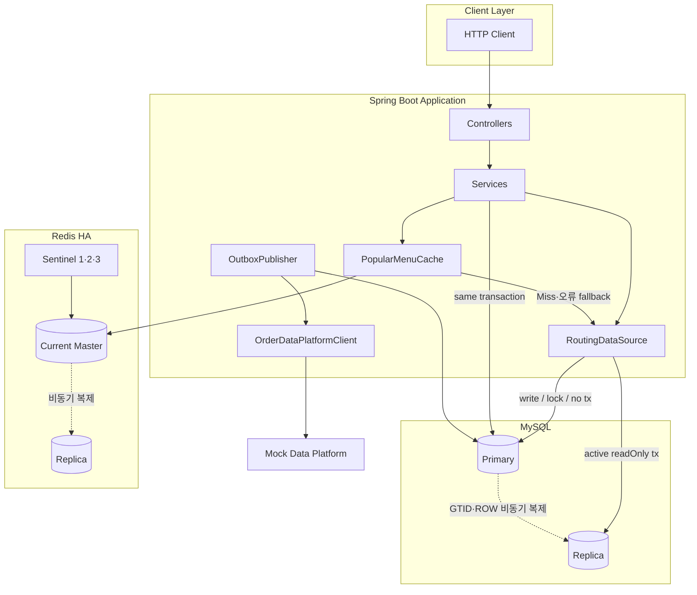
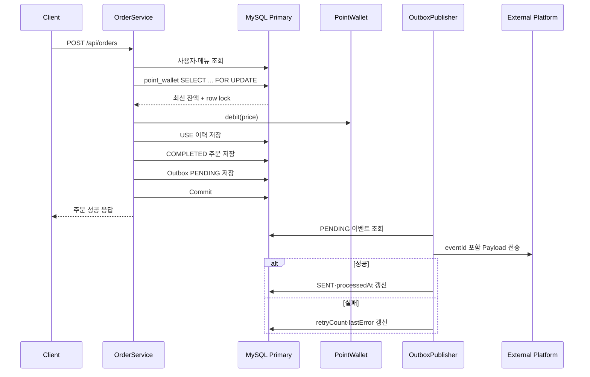
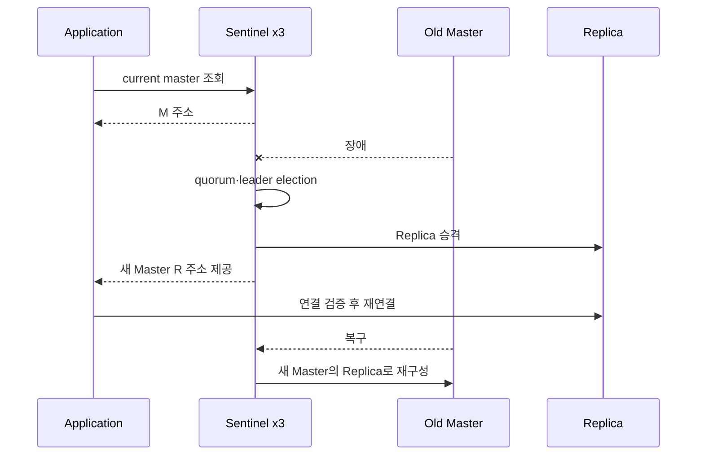

# Software Architecture

## 1. 문서 목적과 범위

이 문서는 포인트 기반 커피 주문 시스템의 기능 요구사항, 설계 의도, 문제 해결 전략, 기술 선택과 검증 결과를 연결하는 최상위 설계 진입점이다.

- `README.md`: 3~5분 안에 프로젝트의 문제·선택·결과를 파악하는 요약
- 이 문서: 전체 아키텍처, 책임 경계, 트랜잭션·정합성·성능·장애 설계의 상세 설명
- 전문 문서: API, ERD, ADR, 벤치마크와 트러블슈팅의 원본 증거

이 문서의 결과는 최신 코드, 테스트, 병합된 PR과 benchmark 문서에서 확인된 범위만 다룬다. 운영 환경 안정성이나 성능을 추정해 성공으로 기록하지 않는다.

## 2. 한눈에 보는 설계·검증 결과

| 관심사 | 문제 | 설계 | 확인된 결과 | 남은 한계 |
|---|---|---|---|---|
| 필수 기능 | 메뉴·포인트·주문·인기 메뉴 | Controller → Service → Repository | API·예외·Rollback 테스트 | 인증·실제 PG 제외 |
| 주문 원자성 | 일부 데이터만 반영될 위험 | 주문·포인트·이력·Outbox 단일 트랜잭션 | 실패 시 전체 Rollback | 외부 시스템까지 단일 트랜잭션 아님 |
| 동시성 | 동일 잔액을 여러 요청이 갱신 | Primary 지갑 행 `PESSIMISTIC_WRITE` | 성공 3·실패 7·잔액 1,000P | 락 타임아웃·재시도 미구현 |
| 인기 메뉴 정확성 | 집계·동률·0건 메뉴 정책 | MySQL `orders` 원본, LEFT JOIN | 경계·정렬·빈 결과 테스트 | 취소 상태 확장 시 재설계 필요 |
| SQL 성능 | 반복 집계 비용 | 실제 쿼리 기반 covering index | 500,000건 중앙값 179.0ms → 66.0ms | 혼합 쓰기 비용 미측정 |
| 캐시 | 반복 집계 DB 부하 | Redis Cache-Aside·TTL·fallback | Hit·Miss·TTL·장애 격리 | Stampede·즉시 무효화 미대응 |
| 후속 전송 | 외부 실패·서버 종료 시 유실 | Transactional Outbox | PENDING/SENT/FAILED·재시도 | Exactly Once 미보장 |
| MySQL 확장 | 읽기 부하와 stale read | Primary·Replica 라우팅 | 실제 복제·라우팅·지연 재현 | 자동 DB Failover 제외 |
| Redis 가용성 | Master 단일 장애점 | Replica·Sentinel 3대·DB fallback | 승격·재연결·전체 장애 복구 | 무중단·무손실 보장 아님 |

## 3. 서비스 개요와 기능 요구사항

### 3.1 필수 API

| 기능 | Method | Endpoint | 핵심 데이터 변경 |
|---|---|---|---|
| 메뉴 목록 | `GET` | `/api/menus` | 없음 |
| 포인트 충전 | `POST` | `/api/users/{userId}/points/charge` | 지갑 증가, `CHARGE` 이력 |
| 주문·결제 | `POST` | `/api/orders` | 지갑 차감, `USE` 이력, 주문, Outbox |
| 인기 메뉴 | `GET` | `/api/menus/popular` | Cache Miss 시 Redis 저장 |

상세 요청·응답·예외 계약은 [API 명세](03_API_SPEC.md)를 따른다.

### 3.2 핵심 도메인 규칙

- 수량은 1개로 고정한다.
- 하나의 주문은 하나의 메뉴만 참조한다.
- ACTIVE 메뉴만 주문할 수 있다.
- 포인트 잔액은 음수가 될 수 없다.
- 성공한 주문만 `orders`에 저장한다.
- 포인트 충전은 `CHARGE`, 주문 사용은 `USE` 이력을 남긴다.
- 인기 메뉴는 MySQL `orders`의 `COMPLETED` 주문을 기준으로 계산한다.
- 주문 후속 데이터 플랫폼 전송은 주문 응답과 분리하되 전송할 이벤트 자체는 주문과 원자적으로 저장한다.

### 3.3 과제 요구사항 추적

| 발제 필수 항목 | 반영 위치 |
|---|---|
| 설계 내용 | 이 문서의 아키텍처·ERD·API·데이터 흐름, [ERD](04_ERD.md), [API 명세](03_API_SPEC.md) |
| 설계 의도 | 트랜잭션, 동시성, 데이터 원본, 시간대, 캐시 책임 경계 |
| 문제 해결 전략·분석 | 적용 전 문제 재현, 후보 비교, 단계별 개선과 장애 주입 |
| 기술 선택 이유 | 각 설계의 대안·트레이드오프 표와 ADR·benchmark |
| 다수 서버·동시성·일관성 | Primary 원본, DB row lock, Replica 라우팅, Sentinel·fallback |
| 기능·제약 테스트 | 단위·통합·실제 MySQL·Redis·K6·장애 검증 |

## 4. 비기능 요구사항

### 4.1 데이터 일관성

- 포인트 잔액, 사용 이력, 주문과 Outbox 이벤트는 한 트랜잭션에서 원자적으로 변경한다.
- 정합성 판단과 비관적 락은 Primary MySQL의 최신 원본 행에서 수행한다.
- Redis와 Replica의 오래된 값은 주문 가능 여부 판단에 사용하지 않는다.

### 4.2 동시성

- 동일 사용자 지갑 행에 대한 변경을 DB row lock으로 직렬화한다.
- 서로 다른 사용자 지갑은 서로 다른 행을 잠그므로 전체 주문을 전역 직렬화하지 않는다.
- 테스트는 동일 사용자 10개 요청의 최종 잔액·주문·이력 수를 함께 판정한다.

### 4.3 성능

- 인기 메뉴 쿼리는 실제 Join·기간·상태·정렬 구조를 기준으로 인덱스를 선택한다.
- 반복 조회는 Redis 결과 캐시로 MySQL 집계를 생략한다.
- 성능 결과에는 Fixture, 반복 횟수, 측정 지표와 일반화 제한을 함께 기록한다.

### 4.4 가용성과 장애 격리

- Redis 장애는 인기 메뉴 캐시 실패로 제한하고 MySQL 원본 결과를 반환한다.
- Redis는 주문·포인트 경로의 의존성이 아니므로 캐시 장애가 결제 실패로 전파되지 않는다.
- Replica 장애가 Primary 쓰기에 영향을 주지 않도록 연결과 책임을 분리한다.
- 외부 데이터 플랫폼 장애는 주문을 Rollback하지 않고 Outbox 재시도 상태로 남긴다.

### 4.5 확장성

- 여러 App 인스턴스가 같은 MySQL Primary를 바라보면 DB row lock이 공통 동시성 제어점으로 작동한다.
- readOnly 조회는 Replica로 분리할 수 있다.
- Redis Sentinel은 현재 Master 주소를 제공해 애플리케이션 재연결을 지원한다.
- 다중 Outbox Publisher 경쟁, 다중 Replica 부하 분산과 자동 DB Failover는 후속 범위다.

## 5. 전체 시스템 구성도



## 6. 도메인 모델과 ERD

```mermaid
erDiagram
    USERS ||--|| POINT_WALLET : owns
    USERS ||--o{ POINT_HISTORY : has
    USERS ||--o{ ORDERS : places
    MENU ||--o{ ORDERS : ordered_as
    ORDERS ||--o| OUTBOX_EVENTS : publishes

    USERS {
        bigint id PK
        varchar name
        datetime created_at
        datetime updated_at
    }
    POINT_WALLET {
        bigint id PK
        bigint user_id FK UK
        bigint balance
        datetime created_at
        datetime updated_at
    }
    POINT_HISTORY {
        bigint id PK
        bigint user_id FK
        bigint amount
        varchar type
        bigint balance_after
        datetime created_at
    }
    MENU {
        bigint id PK
        varchar name
        bigint price
        varchar status
        datetime created_at
        datetime updated_at
    }
    ORDERS {
        bigint id PK
        bigint user_id FK
        bigint menu_id FK
        bigint order_price
        varchar status
        datetime ordered_at
    }
    OUTBOX_EVENTS {
        bigint id PK
        varchar event_id UK
        varchar event_type
        bigint aggregate_id
        text payload
        varchar status
        int retry_count
        varchar last_error
        datetime created_at
        datetime processed_at
    }
```

`outbox_events.aggregate_id`는 주문 ID를 저장하지만 현재 JPA 연관관계 FK로 매핑하지 않고 이벤트 전달용 aggregate 식별값으로 관리한다. 전체 컬럼 정의와 관계는 [ERD 문서](04_ERD.md)를 따른다.

## 7. 애플리케이션 책임 경계

### Controller

- HTTP 요청 검증과 응답 DTO 반환
- Entity를 직접 노출하지 않음
- 포인트·주문·캐시 정책을 직접 구현하지 않음

### Service

- 도메인 흐름과 트랜잭션 경계 관리
- 사용자·메뉴·잔액 검증
- 주문·이력·Outbox 원자 저장
- 인기 메뉴의 KST 기간 계산과 캐시 경유

### Repository

- Entity 저장과 조회
- 지갑 잠금 전용 조회
- 인기 메뉴 Projection 쿼리
- Outbox `PENDING` 순차 조회

### Infrastructure

- RoutingDataSource: Primary·Replica 선택
- Redis Cache: 성능 최적화와 fallback 경계
- Sentinel: 현재 Redis Master 탐색과 Failover
- Docker Compose: MySQL 복제·Redis HA 재현 환경

## 8. 주문·결제 트랜잭션

### 8.1 정상 흐름



### 8.2 Rollback 규칙

다음 중 하나라도 주문 트랜잭션 안에서 실패하면 잔액 차감, `USE` 이력, 주문, Outbox 이벤트를 함께 Rollback한다.

- 사용자·메뉴·지갑 없음
- 메뉴 비활성
- 포인트 부족
- 주문 저장 실패
- Outbox Payload 생성 또는 저장 실패

외부 플랫폼 전송은 Commit된 Outbox를 별도 Publisher가 처리하므로 전송 실패가 완료 주문을 되돌리지 않는다.

### 8.3 성공 주문만 저장하는 판단

현재 `orders`의 의미는 결제가 완료된 주문이다. 실패 요청을 별도 상태로 저장하지 않아 다음을 단순하게 유지한다.

- 주문 내역의 의미
- 인기 메뉴 집계 조건
- 주문 수와 포인트 `USE` 이력 수의 정합성 검증

향후 결제 승인 전 상태나 취소·환불을 도입하면 `PENDING`, `CANCELLED`, `FAILED` 상태 모델과 집계 조건을 다시 설계해야 한다.

## 9. 동시성 제어 설계

### 9.1 적용 전 문제

동일한 10,000P를 가진 사용자가 3,000P 메뉴를 동시에 10번 주문하면 여러 트랜잭션이 같은 잔액을 읽을 수 있다. 락 미적용 테스트에서 10개 주문과 `USE` 이력이 모두 저장됐지만 최종 잔액은 7,000P 또는 4,000P로 남았다.

이는 요청 성공 수와 실제 차감 횟수가 일치하지 않는 Lost Update다.

### 9.2 보호 대상

보호해야 하는 원본은 Redis Key나 사용자 전체가 아니라 Primary MySQL의 해당 사용자 `point_wallet` 행이다.

```text
findByUserForUpdate(user)
→ PESSIMISTIC_WRITE
→ 최신 잔액 확인
→ 차감 또는 충전
→ Commit/Rollback 시 lock 해제
```

### 9.3 적용 후 결과

| 조건 | 결과 |
|---|---|
| 초기 잔액 | 10,000P |
| 메뉴 가격 | 3,000P |
| 동시 주문 | 10개 |
| 성공 | 3개 |
| `INSUFFICIENT_POINT` | 7개 |
| 주문·USE 이력 | 각 3개 |
| 최종 잔액 | 1,000P |

### 9.4 Redis 분산락을 사용하지 않은 이유

- 원본 변경은 MySQL 트랜잭션에서 일어난다.
- 같은 Primary를 사용하는 여러 App 인스턴스에는 DB row lock이 공통으로 작동한다.
- Redis 락을 추가하면 락 획득·TTL·해제 실패와 DB 트랜잭션의 이중 실패 경계를 관리해야 한다.
- 현재 단일 지갑 행 갱신 문제에는 DB 비관적 락이 더 직접적이고 검증 가능하다.

### 9.5 남은 위험

- lock timeout API 정책
- deadlock 재시도
- 주문과 충전의 혼합 경합
- 서로 다른 사용자 요청의 병렬 처리량

## 10. 인기 메뉴 집계 설계

### 10.1 정확성 정책

- 기준 시간대: `Asia/Seoul`
- 범위: 오늘의 7일 전 00:00 이상, 오늘 00:00 미만
- 주문 상태: `COMPLETED`
- 메뉴 상태: `ACTIVE`
- 주문 0건 ACTIVE 메뉴도 후보에 포함
- 정렬: 주문 수 내림차순, 동률이면 메뉴 ID 오름차순
- 최대 3개, 후보가 없으면 빈 배열

### 10.2 SQL 구조

```sql
SELECT m.id, m.name, COUNT(o.id)
FROM menu m
LEFT JOIN orders o
  ON o.menu_id = m.id
 AND o.status = :completed
 AND o.ordered_at >= :fromInclusive
 AND o.ordered_at < :toExclusive
WHERE m.status = :active
GROUP BY m.id, m.name
ORDER BY COUNT(o.id) DESC, m.id ASC
LIMIT 3;
```

기간과 주문 상태를 `WHERE`가 아니라 LEFT JOIN의 `ON` 절에 두어 주문이 없는 ACTIVE 메뉴가 제거되지 않게 한다.

## 11. 인덱스 전략

### 11.1 예상이 아닌 실제 쿼리 기준 비교

초기 단순 SQL 예시만 보면 `ordered_at` 선두가 자연스러워 보일 수 있다. 그러나 실제 쿼리는 ACTIVE 메뉴에서 시작해 `o.menu_id = m.id`로 주문을 반복 조회한다. 따라서 Join 경로와 Projection에 필요한 컬럼을 함께 비교했다.

### 11.2 측정 조건과 결과

- MySQL 8.4 Docker
- 일반 개발 DB와 분리된 전용 스키마
- 주문 500,000건
- 메뉴 20개, ACTIVE 15개
- 최근 7일 주문 약 10%
- 워밍업 3회, `EXPLAIN ANALYZE` 5회 중앙값

| 후보 | 중앙값 | 판단 |
|---|---:|---|
| `(menu_id)` | 179.0ms | 기준선, non-covering |
| `(ordered_at, menu_id)` | 184.0ms | 실제 계획에서 기존 menu_id 인덱스 사용 |
| `(menu_id, status, ordered_at)` | 71.5ms | covering |
| `(menu_id, ordered_at)` | 202.0ms | status 테이블 조회 필요 |
| `(menu_id, ordered_at, status)` | 66.0ms | 최종 선택, covering |

현재 모든 주문이 `COMPLETED`라 `status`는 선택도가 없다. 최종 D가 이번 표본에서 가장 낮았지만 B보다 구조적으로 항상 빠르다고 단정하지 않는다. 주문 상태가 다양해지면 실제 상태 분포로 B와 D를 재측정한다.

### 11.3 비용

최종 복합 인덱스는 격리 스키마의 기준선 대비 인덱스 공간이 약 21.7% 증가했다. INSERT·UPDATE 유지 비용은 별도로 측정하지 않았으므로 조회 개선만으로 운영 최적이라고 단정하지 않는다.

원본 결과는 [Issue #12 벤치마크](benchmarks/issue-12-popular-menu-index.md)를 따른다.

## 12. Redis Cache-Aside 설계

### 12.1 데이터 원본

```text
정확한 원본: MySQL orders
성능용 복사본: Redis 인기 메뉴 결과
```

Redis ZSet을 주문 시점에 직접 증가시키지 않은 이유는 다음과 같다.

- DB Commit 성공 후 Redis 증가 실패
- Redis 증가 후 DB Rollback
- 최근 7일 윈도우 만료와 취소 보정
- 장애 후 재구축·대사와 멱등 재처리

현재 조회 빈도와 범위에서는 완성된 MySQL 집계 결과를 캐시하는 방식이 더 단순하고 복구 가능하다.

### 12.2 Key와 TTL

```text
popular:menus:7days:{businessDate}:v1
```

- `businessDate`: 주입된 Clock의 현재 시각을 KST로 변환한 날짜
- 기본 TTL: 86,400초
- 날짜 전환 시 새 Key 사용
- `:v1`: 직렬화·정책 변경 시 Key 버전 분리

TTL은 날짜 전환을 만드는 장치가 아니라 이전 날짜 Key를 정리하는 수명 정책이다. 같은 날짜에도 과거 주문이나 메뉴 상태가 수정되면 TTL 동안 stale할 수 있다.

### 12.3 정상·실패 흐름

```text
Hit
→ Redis 역직렬화 결과 반환
→ MySQL 집계 생략

Miss
→ MySQL 조회
→ Redis에 JSON + TTL 저장
→ MySQL 결과 반환

Redis read/write/deserialize 실패
→ warn 로그
→ MySQL 원본 조회·반환
```

캐시 오류를 비즈니스 예외로 전파하지 않는 이유는 Redis가 정확성 원본이 아니기 때문이다.

### 12.4 성능 결과

| 시나리오 | 평균 | p95 | RPS | 실패율 |
|---|---:|---:|---:|---:|
| MySQL 직접 조회 | 11.13ms | 14.48ms | 2,680.1 | 0% |
| Cache Hit | 9.30ms | 11.81ms | 3,205.8 | 0% |

- 평균 응답시간 약 16.4% 감소
- p95 약 18.4% 감소
- 측정 구간 RPS 약 19.6% 증가

로컬 단일 장비·소규모 데이터 결과이며 상세 조건과 무효 측정 제외 근거는 [Issue #45 K6 문서](benchmarks/issue-45-popular-menu-k6.md)를 따른다.

### 12.5 남은 한계

- 동시에 많은 Miss가 발생하는 Cache Stampede
- 과거 주문·메뉴 상태 변경 시 즉시 무효화
- 운영 규모 데이터와 네트워크 지연

## 13. 주문 후속 처리와 외부 전송

### 13.1 단계별 진화

| 단계 | 확인한 문제 | 개선 |
|---|---|---|
| 동기 외부 호출 | 외부 지연·실패가 주문 응답과 Rollback에 직접 영향 | 호출 책임 분리 필요 확인 |
| Spring Event | 주문 코드와 Listener 책임 분리 | 같은 트랜잭션·호출 스택 영향은 남음 |
| AFTER_COMMIT | Rollback된 주문의 후속 처리 방지 | Commit 후 프로세스 장애 시 유실 가능 |
| `@Async` | 응답 지연 격리 | Executor 포화·서버 종료 시 메모리 이벤트 유실 가능 |
| Transactional Outbox | DB에 재시도 가능한 이벤트 저장 | 중복 전송·멀티 Publisher 경쟁은 남음 |

현재 production 경로는 Transactional Outbox다.

### 13.2 Outbox 상태

- `PENDING`: 전송 또는 재시도 대상
- `SENT`: 외부 전송 성공과 처리 시각 기록
- `FAILED`: 최대 재시도 도달
- `retryCount`, `lastError`: 실패 원인과 횟수 보존
- `eventId`: 같은 Outbox 이벤트 재시도의 동일성 키

### 13.3 전달 보장 범위

주문과 Outbox 저장은 원자적이지만 다음 구간은 하나의 분산 트랜잭션이 아니다.

```text
외부 전송 성공
→ SENT DB 갱신 전 서버 장애
→ PENDING 재조회
→ 동일 eventId 재전송 가능
```

따라서 Producer는 같은 `eventId`를 전달하지만 Consumer 멱등 저장소가 없는 현재 구현은 Exactly Once를 보장하지 않는다.

### 13.4 후속 개선

- Consumer의 `eventId` unique 저장·중복 무시
- 멀티 인스턴스 Publisher의 행 선점과 `SKIP LOCKED`
- 재시도 지수 백오프·DLQ·관리자 재처리
- 필요성이 확인될 때 RabbitMQ 또는 Kafka 연결

## 14. MySQL 읽기·쓰기 분리

### 14.1 라우팅 정책

| 실행 문맥 | 대상 | 이유 |
|---|---|---|
| 활성 readOnly 트랜잭션 | Replica | 지연 허용 조회의 Primary 읽기 부하 분리 |
| 쓰기 가능 트랜잭션 | Primary | 원본 변경과 최신 값 필요 |
| 트랜잭션 밖 조회 | Primary | Replica 사용이 안전하다는 근거가 없으므로 보수적 기본값 |
| 비관적 락 조회 | Primary | 실제 변경 원본 행과 같은 lock 필요 |

`@Transactional(readOnly = true)`만으로 충분하다고 가정하지 않고 `AbstractRoutingDataSource`가 트랜잭션 상태를 읽어 대상을 결정한다. `LazyConnectionDataSourceProxy`는 실제 SQL 시점까지 Connection 획득을 늦춰 이미 결정된 readOnly 속성을 라우팅에 반영한다.

### 14.2 왜 지갑 조회를 Replica에 보내면 안 되는가

- 비동기 복제 지연으로 잔액이 오래됐을 수 있다.
- Replica에서 얻은 lock은 Primary 행의 다른 주문 트랜잭션과 공유되지 않는다.
- Replica는 읽기 전용 구성이므로 원본 변경 트랜잭션을 완성할 수 없다.

### 14.3 검증

- Primary 쓰기가 Replica에 복제되는지 확인
- `@@hostname`, `@@read_only` 등으로 실제 대상 식별
- 실제 JPA Service·Repository 경로에서 메뉴 조회→Replica 확인
- 주문·충전·PESSIMISTIC_WRITE→Primary 확인
- Replica SQL thread 중지→stale read 재현→재개 후 복구
- Replica 중지 중 Primary probe 쓰기 지속 확인

### 14.4 장애 정책과 한계

Replica 장애 시 메뉴·인기 메뉴를 Primary로 자동 fallback하지 않는다. 자동 전환은 가용성을 높일 수 있지만 장애 순간 읽기 부하가 Primary에 몰려 주문·포인트 원본 처리를 위협할 수 있다.

현재 확인한 것은 DB 수준의 복제·라우팅·지연·복구다. Replica 장애 중 실제 메뉴 API HTTP 오류 응답 규격은 미검증이다. Primary 자동 Failover도 포함하지 않는다.

## 15. Redis Sentinel과 DB fallback

### 15.1 구성

- Redis Master 1
- Redis Replica 1
- Sentinel 3
- quorum 2
- Spring Data Redis Sentinel 연결
- `redis-ha` profile에서 공유 Lettuce Connection 유효성 검증

quorum 2는 최소 두 Sentinel이 Master의 객관적 장애에 동의해야 한다는 뜻이다. 실제 Failover에는 Sentinel 리더 선출과 과반수 승인이 추가로 필요하다.

### 15.2 Failover 흐름



### 15.3 전체 장애 fallback

Redis·Sentinel이 모두 사용할 수 없어도 `PopularMenuCache`는 예외를 격리하고 MySQL 결과를 반환한다. 주문과 포인트 Service는 Redis를 참조하지 않으므로 그대로 Primary 트랜잭션을 실행한다.

### 15.4 직접 검증 결과

- `SENTINEL CKQUORUM` 성공
- Failover 전후 Master 주소·역할 확인
- 연속 두 번의 Failover 스크립트 exit 0
- `+promoted-slave`, `+switch-master` 로그 확인
- Redis 전체 장애 중 인기 메뉴 HTTP 200
- 같은 장애 중 충전·주문 HTTP 200과 MySQL 잔액·주문·이력 확인
- 전체 복구 후 app-ha 재시작 없이 Cache Miss 재적재와 다음 Hit 확인
- 연결 검증 적용 전 로컬 약 43초 지연, 적용 후 첫 요청 0초 확인

### 15.5 해석 제한

- Failover 중 지연·일부 요청 실패 가능
- 비동기 복제로 직전 캐시 쓰기 유실 가능
- 캐시 유실은 다음 Miss에서 MySQL로 복구
- 로컬 Docker 결과이며 운영 SLA·무중단 보장이 아님

## 16. 시간대와 업무 날짜

### 16.1 정책

| 대상 | 타입·시간대 |
|---|---|
| 주문 저장 | UTC `Instant` |
| Outbox 생성·처리 시각 | UTC `Instant` |
| JDBC·Hibernate | UTC |
| API 주문 시각 표현 | KST 변환 |
| 인기 메뉴 기간 | KST 자정 경계 |
| Redis Key 날짜 | KST 업무 날짜 |

### 16.2 분리 이유

DB 저장은 인스턴스 위치와 무관한 절대 시각으로 통일한다. “오늘”과 “최근 완료 일자”는 서비스 이용자의 업무 시간대인 KST로 해석한다.

고정 `Clock` 테스트로 UTC와 KST 날짜가 다른 자정 경계를 검증한다. 서버 기본 Zone에 의존하는 `LocalDateTime.now()`와 `Clock.systemDefaultZone()`은 사용하지 않는다.

## 17. 테스트·성능·장애 검증 전략

### 17.1 테스트 계층

| 계층 | 목적 |
|---|---|
| Domain·Service 단위 테스트 | 규칙·예외·협력 호출 확인 |
| H2 통합 테스트 | 트랜잭션·JPA·Rollback 회귀 |
| 실제 MySQL `concurrencyTest` | DB lock과 동시 요청 정합성 |
| 실제 Redis 통합 테스트 | Key·TTL·Hit·만료·fallback |
| Replication 통합 테스트 | 실제 Service/Repository 라우팅 |
| Docker 직접 검증 | 복제 지연·장애·Sentinel Failover |
| K6 | 동일 조건의 MySQL 직접 조회와 Cache Hit 비교 |

`./gradlew test`는 비결정적·환경 의존 동시성 테스트를 제외한다. 실제 MySQL 동시성 테스트는 별도 `concurrencyTest` task로 실행한다. Sentinel 통합 테스트도 Docker network 안의 별도 profile에서 실행한다.

### 17.2 테스트가 증명하지 않는 것

- 테스트 통과만으로 운영 SLA 보장
- 단일 로컬 K6 결과의 운영 TPS 일반화
- MySQL Primary 자동 Failover
- Redis Failover의 절대 무중단·무손실
- Outbox Exactly Once
- 모든 lock timeout·deadlock·네트워크 분할 시나리오

### 17.3 증거 원칙

- 실행한 명령과 환경을 기록한다.
- 테스트가 보장하는 범위와 보장하지 않는 범위를 분리한다.
- 최초 무효 K6 실행은 결과에서 제외한다.
- PR 요약값은 benchmark 원문과 대조한다.
- Issue·PR 상태보다 실제 merged Diff와 최신 문서를 우선한다.

## 18. 주요 대안과 트레이드오프

| 문제 | 선택 | 대안 | 판단 |
|---|---|---|---|
| 포인트 동시성 | MySQL 비관적 락 | 낙관적 락·조건부 UPDATE·Redis 락 | 원본 행을 직접 보호하고 학습 범위에 적합 |
| 인기 메뉴 | MySQL 집계 + 결과 캐시 | Redis ZSet | 정합성·보정 비용보다 단순 복구 가능성 우선 |
| 읽기 분리 | Spring RoutingDataSource | Repository 이중화·ProxySQL | 현재 JPA 구조 유지와 트랜잭션 학습 가치 |
| Replica 장애 | 명시적 읽기 실패 | 자동 Primary fallback | 장애 시 Primary 연쇄 과부하를 숨기지 않음 |
| Redis HA | Sentinel | Master-Replica만·Cluster | 자동 승격 필요, 샤딩은 과도함 |
| 외부 이벤트 | Transactional Outbox | AFTER_COMMIT·Async·브로커 직행 | DB Commit과 이벤트 존재의 원자성 우선 |
| Outbox 전송 | Scheduled Publisher | RabbitMQ·Kafka | 현재 규모에서 브로커 운영비보다 문제 검증 우선 |

## 19. AI-assisted 개발에서 발견한 설계 누락

AI는 반복 작업을 가속했지만 최종 판단 주체로 사용하지 않았다.

### 19.1 후속 처리 빌드업 누락

최초 Issue가 동기 외부 호출의 지연·실패를 재현하지 않고 Spring Event·AFTER_COMMIT을 바로 완료 조건으로 제시했다. Human 지적으로 기준선부터 Event, AFTER_COMMIT, Async, Outbox까지 단계적으로 문제와 한계를 검증했다.

### 19.2 시간대 불일치

주문 저장과 인기 메뉴 집계가 다른 시간 기준을 사용했다. `Clock` 주입, UTC `Instant` 저장, KST 업무 날짜와 자정 경계 테스트로 통일했다.

### 19.3 쿼리·인덱스 전제 오류

단순 SQL 예시의 컬럼 순서를 실제 인덱스 정답으로 가정하지 않았다. 실제 ACTIVE 메뉴 LEFT JOIN, 주문 상태·기간·Projection 구조와 50만 건 실행계획을 기준으로 후보를 다시 비교했다.

### 19.4 Redis 원본 판단

Redis ZSet을 랭킹 원본으로 둘 때 DB·Redis 이중 쓰기와 보정 책임이 생김을 확인했다. MySQL `orders`를 원본으로 고정하고 Redis를 조회 결과 캐시로 제한했다.

### 19.5 성능 측정 유효성

최초 Docker K6 실행은 Spring Boot 프로세스가 측정 동안 유지되지 않아 무효 처리했다. Human 로컬에서 워밍업·본 측정·3회 반복과 캐시 상태 통제를 수행한 값만 사용했다.

### 19.6 Outbox eventId 전달 누락

Entity와 Payload에 `eventId`가 있어도 외부 Client까지 전달되지 않으면 멱등성 계약이 완성되지 않는다. Human이 이 누락을 발견해 DB 저장→Payload→역직렬화→Client→재시도 동일성까지 검증했다.

### 19.7 AI 역할 충돌

기존에는 Codex가 구현자인 동시에 Human 답변을 평가·보완했다. 검증 독립성이 약해져 다음 최종 흐름으로 수정했다.

```text
Codex 구현·Draft PR
→ Human 이해도 작성
→ ChatGPT PR 전체 검증 및 리뷰 댓글
→ Human 반영 범위 결정
→ Codex 승인된 리뷰 수정
→ ChatGPT 최신 Head 재검토
→ Human 최종 Merge
```

### 19.8 과도한 자동화 축소

Planner·Implementer·Reviewer를 상시 분리하고 Hook·Gate를 계속 늘리는 방식은 개인과제의 구현 시간을 침범했다. 하나의 READY Issue를 단일 Codex가 Draft PR까지 처리하고 위험한 변경에만 독립 검증을 추가하는 최소 하네스로 축소했다.

## 20. 실행·재현 방법

### 20.1 기본 환경

- Java 17
- Spring Boot 4.1.0
- MySQL 8.4
- Redis 7.4
- Docker Compose
- K6는 성능 재측정 시 별도 설치

### 20.2 기본 실행

```bash
cp .env.example .env
docker compose up -d mysql-primary mysql-replica redis-master
./gradlew bootRun
```

### 20.3 일반 검증

```bash
./gradlew test
./gradlew build
git diff --check
git status
git diff --stat
git diff
```

### 20.4 MySQL 동시성

```bash
set -a; source .env; set +a
DB_USERNAME="$MYSQL_USER" DB_PASSWORD="$MYSQL_PASSWORD" \
  ./gradlew --no-daemon concurrencyTest
```

### 20.5 MySQL 복제

```bash
docker compose up -d mysql-primary mysql-replica

docker compose exec mysql-replica sh -c \
  'mysql -uroot -p"$MYSQL_ROOT_PASSWORD" -e "SHOW REPLICA STATUS\\G"'
```

초기화 스크립트는 빈 volume에서만 실행된다. `docker compose down -v`는 데이터를 삭제하므로 재구축 전에 백업 필요성을 판단한다.

### 20.6 Redis Sentinel

```bash
docker compose --profile redis-ha up -d --build app-ha
scripts/redis/verify-sentinel-failover.sh

docker compose --profile redis-ha-test run --rm redis-ha-integration-test
```

장애 검증 후:

```bash
docker compose --profile redis-ha down
```

### 20.7 K6

```bash
scripts/k6/run-popular-menu-benchmark.sh mysql
scripts/k6/run-popular-menu-benchmark.sh hit
scripts/k6/run-popular-menu-benchmark.sh miss
```

실행 전에 캐시 활성화 설정, 애플리케이션 프로세스 유지, Key 존재 여부를 확인한다.

## 21. 알려진 한계와 운영 확장 방향

### 현재 한계

- 인증·인가와 실제 PG 연동 없음
- 주문 수량·취소·환불 상태 없음
- Outbox 멀티 Publisher 경쟁 제어 없음
- Consumer 멱등 저장소와 Exactly Once 없음
- MySQL 자동 Failover 없음
- Replica 장애 HTTP 오류 계약 미검증
- Redis Failover 중 일시 지연·실패와 캐시 유실 가능
- Cache Stampede와 즉시 무효화 없음
- 운영 규모 부하·장기 관측·보안 비밀 관리 미구현

### 확장 우선순위

1. Outbox Consumer 멱등성과 멀티 Publisher 선점
2. Replica 장애의 API 오류·fallback·회로 차단 정책 결정
3. 주문 취소·환불 도메인 추가 시 상태·인덱스·캐시 재설계
4. 운영에 가까운 데이터 분포와 혼합 읽기·쓰기 부하 재측정
5. 필요성이 확인될 때 메시지 브로커, DB Failover와 모니터링 도입

RabbitMQ, Kafka, MSA, Kubernetes를 먼저 추가하는 것은 현재 프로젝트의 핵심 검증보다 설정 비용이 크므로 후속 요구가 명확해질 때만 검토한다.

## 22. 관련 문서

- [README](../README.md)
- [Project Context](01_PROJECT_CONTEXT.md)
- [Requirements](02_REQUIREMENTS.md)
- [API Spec](03_API_SPEC.md)
- [ERD](04_ERD.md)
- [AI Workflow](05_AI_WORKFLOW.md)
- [Troubleshooting](09_TROUBLESHOOTING.md)
- [AI Review Log](10_AI_REVIEW_LOG.md)
- [Evidence Guide](12_EVIDENCE_GUIDE.md)
- [AI Workflow Evolution](13_AI_WORKFLOW_EVOLUTION.md)
- [ADR-001 인기 메뉴 캐시 전략](adr/ADR-001-popular-menu-cache-strategy.md)
- [Issue #12 인기 메뉴 인덱스](benchmarks/issue-12-popular-menu-index.md)
- [Issue #13 Redis 캐시](benchmarks/issue-13-popular-menu-redis-cache.md)
- [Issue #45 K6 비교](benchmarks/issue-45-popular-menu-k6.md)
